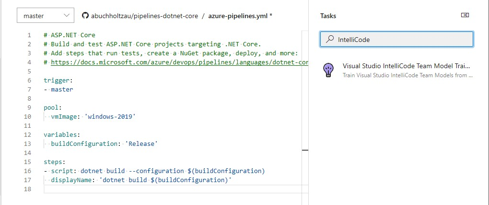
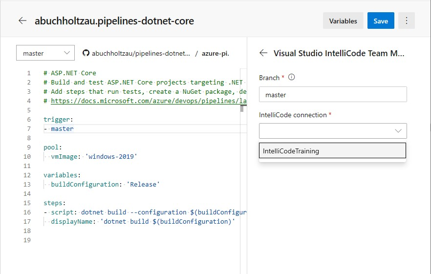
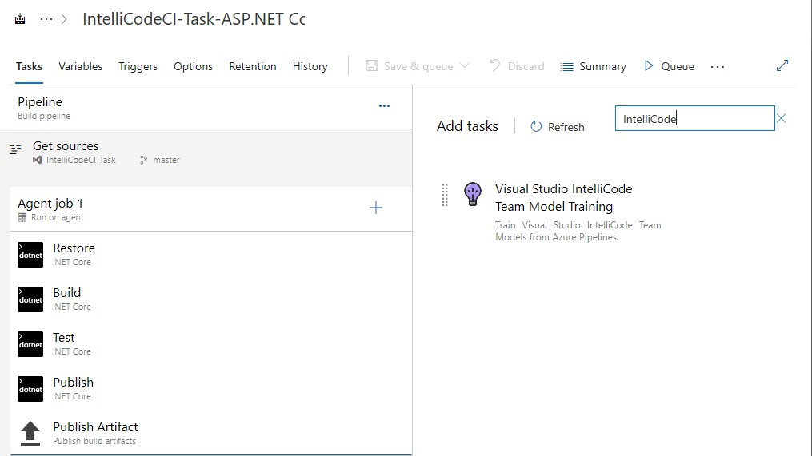
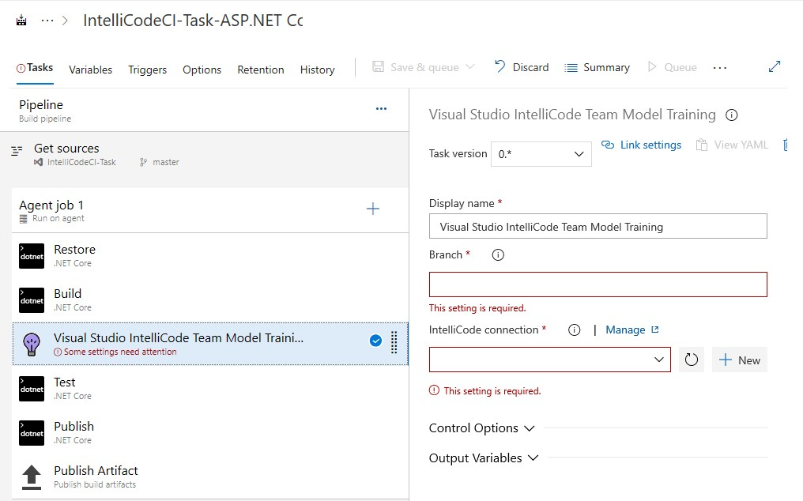
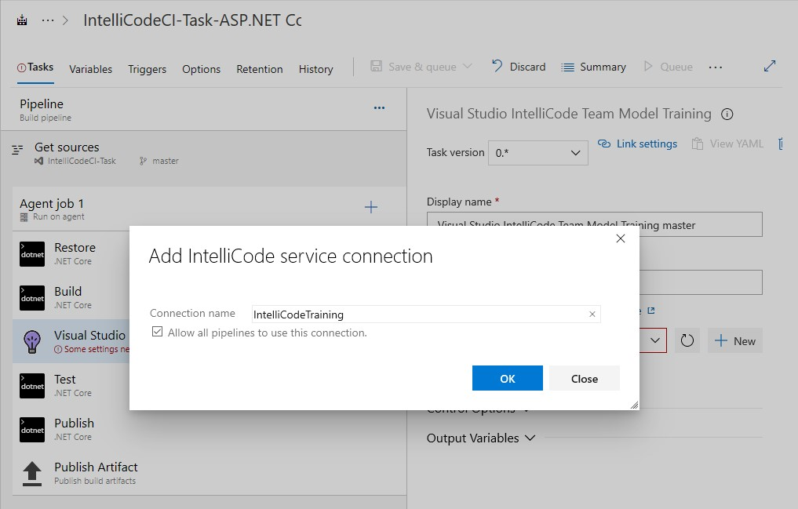
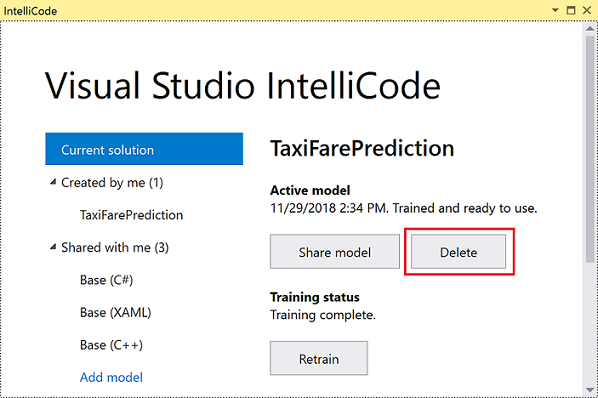

# IntelliCode team completions: AI-assisted IntelliSense based on your code

Use IntelliCode team models for completions to get AI-assisted IntelliSense recommendations based on your C# and C++ codebases. Team completions are useful when working with your own types or domain-specific libraries that aren’t commonly used in open source code. This is because IntelliCode’s base model recommendations are based solely on patterns learned from open-source GitHub repos. When working with code that isn’t in that set of repos, those recommendations aren't as useful to you. C# and C++ users in Visual Studio can now use IntelliCode to learn patterns from their code to make recommendations tailored to _your_ code. 

An IntelliCode model is an encapsulation of a set of rules that allow prediction of some useful information (for example, recommendations in the IntelliSense list) based on an analysis of code. IntelliCode creates custom models for your team using the same learning process as for the IntelliCode base models, except they are trained on your own code. The more code you provide to illustrate your patterns of usage, the more capable the custom model will be at offering useful recommendations. 

To build your team model, we extract a summary file with metadata on your types and their usages and [securely upload](#data-and-privacy) it to our service.

> [!NOTE]
> Team completions are a preview feature and is disabled by default. It can be enabled through **Tools** > **Options** > **IntelliCode**. It is currently available only for C# and C++ code.

## How models get applied

IntelliCode generates its recommendations from multiple models by merging together:

- The base model for the language you're using (which is trained on thousands of public GitHub repos)
- Any team models you've trained
- Any team models which are associated with the Git repository you’re working in
- Any team models you've added to your profile from sharing links that others gave you

You don't need to manage which models apply to which solution or codebase because IntelliCode takes care of this for you.

## Types of team models

You are two ways you can obtain team models:

1.	**Repository-associated**: Models are tied to the repository and all users who can clone and edit the repository are granted automatic access to the model. See [automatic acquisition of team models for more information](#sharing-your-repository-associated-models)

>[!NOTE]
> Your codebase must be under Git source control and pushed to a remote to create a repository-associated model.

2. **User-associated**: Models are tied to your personal identity and must be shared with others through a sharing link. 
   - This type of team model is only available for C# and will be deprecated in the next year.

## Repository-associated team models

### Create your model

To get useful predictions, a codebase should represent the common usage patterns for the APIs, objects, and methods that you use. A codebase with a wide variety of common usage patterns will create a model that provides useful results for more cases.
[Learn more]() 

Requirements:
1.	The repository must not already have a repository-associated model already trained on it.
2.	The repository must be under Git source control.
3. You must enable the following settings in **Tools** > **Options** > **IntelliCode**.
   - C# or C++ team models for completions
   - Acquire team models for completions

To train a repository-associated model, follow these steps:
1.	Clone the repository with the solution you’d like to train on.
2.	Open the solution or repository folder in Visual Studio.
3.	Create a model by going to **View** > **Other Windows** > **Train IntelliCode model on this repository** or by searching for the command in Visual Studio Search (**Ctrl + Q**). 
4.	You’ll be prompted to sign-in with the account you’d like to use.
5.	Upon successful creation of the model, it will be automatically downloaded to Visual Studio. You can track the model’s progress by opening the Output Window and switching to IntelliCode in the dropdown. 

You can also build a repository-associated model by [integrating our build task](#automatically-create-and-retrain-a-model-in-Azure-Pipelines) as part of your Azure DevOps CI pipeline.

>[!NOTE] 
>You must open a solution or folder of code in Visual Studio in order to train a model.

### Retrain your model

For AI-assisted IntelliSense recommendations, the model becomes stale if you make changes such as renaming a method or adding new methods. The model doesn't know about those changes until you train it again. If you've made numerous changes or additions to a codebase, consider retraining any models that were created from it.

You can retrain your model manually by opening the associated repository and going to **View** > **Other Windows** > **Train IntelliCode model on this repository** or [automatically](#automatically-create-and-retrain-a-model-in-Azure-Pipelines) as part of a continuous integration (CI) pipeline.

There's no benefit to retraining your model unless you’ve made significant code changes and would like to see those changes reflected in IntelliCode's recommendations.

### Automatically create and retrain a model in Azure Pipelines

You can automatically create and retrain a model as part of your continuous integration (CI) pipeline in [Azure Pipelines](/azure/devops/pipelines/get-started/what-is-azure-pipelines?view=azure-devops). When code changes are pushed to your repository and the build task runs, the team model for completions is retrained and then made available to everyone that you've shared the model with. Visual Studio periodically checks for updates to custom models and will download updates to your team model automatically.

Before you start, make sure that:

   - You have permission to create and edit pipelines for the project.
   - Your project uses Git source control.
   - The build agent has the minimum required version of Visual Studio installed.
      - For C# repositories: Visual Studio 2017 or higher
      - For C++ repositories: Visual Studio 2019 Update 4 or higher
   - The IntelliCode task must be completed within 1 hour of the start of the pipeline. 
      - We recommend setting up a simpler pipeline for the IntelliCode task if you have a lengthy build process.
   - You have enabled acquisition of team models. You can verify this setting in **Tools** > **Options** > **IntelliCode** > **Acquire team models for completions**.

#### Setup
1. Install the [Visual Studio IntelliCode Build task](https://marketplace.visualstudio.com/items?itemName=VisualStudioExptTeam.VSIntelliCodeBuild) from Visual Studio Marketplace to your Azure DevOps organization and select the organization you’d like to add the task to.

   

   - This task scans your source code and extracts the data it needs to create an IntelliCode model. The extracted data is uploaded to the IntelliCode service, which creates the model and associates it with your account.
1. Set up a [service connection](https://docs.microsoft.com/azure/devops/pipelines/library/service-endpoints?view=azure-devops&tabs=yaml) for IntelliCode. You only need to do this once, the same connection can be reused for multiple pipelines.

#### Set up team model creation and retraining in Azure Pipelines using the [YAML editor](https://docs.microsoft.com/azure/devops/pipelines/customize-pipeline?view=azure-devops):

1.	Search for and add the IntelliCode task in the assistant pane.

2. In the task configuration pane, type the branch that you want to train the model on. 
   - We recommend using any persistent branch such as master or a release branch.
3. Select the IntelliCode service connection you'd like to use for this task from the dropdown.
   - If you don't have an available service connection, you'll need to [create one](https://docs.microsoft.com/azure/devops/pipelines/library/service-endpoints?view=azure-devops&tabs=yaml) before you can proceed.

3.	Ensure the IntelliCode Model Training task occurs after your build step.
4.	Save and run your pipeline to create your model.
5.	Open the corresponding repository from your pipeline in Visual Studio to download the created team model via the automatic team model acquisition feature after your pipeline completes.
6.	Your model will be automatically updated and shared with each CI build.

#### Set up team model creation and retraining in Azure Pipelines using the [classic editor](https://docs.microsoft.com/azure/devops/pipelines/get-started/pipelines-get-started?view=azure-devops&tabs=classic):

3. Add the IntelliCode Build task to your pipeline. Place it after any build tasks.

4. In the task configuration pane, select the branch that you want to train the model on. We recommend using any persistent branch such as master or a release branch.

5. Select an existing IntelliCode connection from the dropdown or select New to create a new OAuth 2.0 connection to the IntelliCode service. This connection is used to upload the training data to create the model. 

6. Save and run your pipeline to create your team model.
7. Open the corresponding repository to your pipeline in Visual Studio to to automatically download the created team model via the [automatic team model acquisition](#sharing-your-repository-associated-models) feature after your pipeline completes.
8. Your model will be automatically updated with each CI build.

### Sharing your repository-associated models

Repository-associated models are automatically shared with others working in the same codebase as long as users have enabled automatic acquisition of team models in Visual Studio. 
Enable automatic acquisition by going to **Tools** > **Options** > **IntelliCode** > **Acquire team models for completion**.

When anyone clones and opens the codebase the model was trained on, any models associated with the configured Git remote repositories will be downloaded and activated. If you are working on a fork of the codebase, simply add the upstream codebase as a remote repository to get the model.

Access to the repository is access to the model. When training, we collect some information about the checked-out commit. Anyone who requests that model must have the same commit in their repository and be able to produce the same information that was collected during training in order to receive the team model.

You can also share your model by going to **View** > **Other Windows** > **IntelliCode Model Management**, selecting your model from the left pane, and hitting the **Share** button. This generates a sharing link you can send to anyone you'd like to share the model with.

### Delete your model

You can remove models from your account so they can no longer be used.

#### Delete a repository-associated model created within Visual Studio

1.	Find the model ID by going to **View** > **Other Windows** > **List IntelliCode models**. 
      - You can also search for **List IntelliCode models** in Visual Studio Search (**Ctrl + Q**).
2.	You’ll be prompted to sign-in with the account you used when you trained the model.
3.	Copy the model ID for the model you’d like to delete.
      - All IntelliCode models you have access to will be listed in the Output window. 
4.	Go to **View** > **Other Windows** > **Delete IntelliCode models**. Paste the model ID into the box and hit **Delete**.

#### Delete a model created from the Azure DevOps task

1.	Delete the **Visual Studio IntelliCode Team Model Training** task from your pipeline.
2.	Open Visual Studio and find the model ID by going to **View** > **Other Windows** > **List IntelliCode models**.
      - You can also search for List IntelliCode models in Visual Studio Search (Ctrl + Q). 
3.	You’ll be prompted to sign-in with the same account  you used to set up the IntelliCode service connection in Azure DevOps.
4.	Copy the model ID for the model you’d like to delete.
      - All IntelliCode models you have access to will be listed in the Output window. 
5.	Go to **View** > **Other Windows** > **Delete IntelliCode models**. Paste the model ID into the box and hit **Delete**.

When you delete your models, your request will remove the model from your account, and the data will be purged from IntelliCode’s systems within 72 hours.

## User-associated team models

> [!NOTE] 
> User-associated team models will be deprecated in the next year. We encourage you to utilize [repository-associated team models](#repository-associated-team-models) moving forward.

### Create your model

> [!NOTE] 
> Team completions is a preview feature for C# and is disabled by default. It can be enabled through Tools > Options > IntelliCode > C# team models for completions.

Train a user-associated model:
1.	Open the project or solution in Visual Studio.
2.	Open the IntelliCode page by choosing View > Other Windows > IntelliCode Model Management.
3.	Choose **Create new model**.

### Share your model

After you've trained a model, the **Share model** button appears. Click the button to copy the sharing link. From there, you can share the link with your collaborators.

 > [!NOTE]
 > Anyone who has the sharing link can access the model and its suggestions, so make sure that everyone who receives the link is aware of this.

You can share your model with as many people as you like via the sharing feature. Team members can't retrain the model but they do see the same completion recommendations as you do.

For more information about sharing models, see [How to: Share custom models](share-models.md).

## Retrain your model

Your team model becomes stale if you make changes such as renaming a method or adding new methods. The model doesn't know about those changes until you train it again. If you've made numerous changes or additions to a codebase, consider retraining any models that were created from it.

There's no benefit to retraining your model unless you’ve made significant code changes and would like to see those changes reflected in IntelliCode's recommendations.

## Delete a model

You can remove models from your account so they can no longer be used. To do this, choose the **Delete** button on the IntelliCode training page in Visual Studio.

When you delete your models, your request will remove the model from your account, and the data will be purged from IntelliCode’s systems within 72 hours.

### Train on a public codebase

Before you train on your own code, you might want to create a custom model on a public codebase. You can see how the custom model affects IntelliSense, or if you're concerned about the kind of data that IntelliSense collects, you can inspect the extracted data. Some interesting samples to train on are:

- [Azure ConferenceBuddy](https://github.com/Azure/ConferenceBuddy)

   Fork the repo to your personal account, clone the repo, open the *ConferenceBuddy.sln* solution, build to check that it's working, and then train the model. You'll find some good completions on instances of the **AskWhoTask** class.

- [Windows RSS reader](https://github.com/Microsoft/Windows-appsample-rssreader)

   Fork the repo to your personal account, clone the repo, open the *RssReader.sln* solution, build to check that it's working, and then train the model. You'll find some good completions on instances of the **MainViewModel** class.

## Data and privacy

To build your team model, we extract a summary file with metadata on your types and their usages. For example, the summary file contains the names of classes and methods and how often they're called in different circumstances. IntelliCode doesn't track your keystrokes or extract whole expressions, statements, or literal values (such as strings) from your code.

The extracted data is transmitted, over HTTPS, to the IntelliCode service. The service then uses machine learning algorithms to train a model for your code. It returns the model to your computer where it's merged with the base model.

### View extracted data

To inspect the contents of the extracted data:

1. Open the extracted data directory:
   - For repository-associated models: %temp%\Intellicode_Extraction_2019-10-23—234524
   - For user-associated mdoels: *%TEMP%\Visual Studio IntelliCode*

1. To find and open the training for your most recent training session, sort the folder view by date (descending). The folder for your most recent training session is now at the top.

   > [!TIP]
   > There's one folder per training session in the *%TEMP%\Visual Studio IntelliCode* directory, each with a randomized name.

The folder contains the entire set of files that are sent to Microsoft when extraction is complete. The *UsageOutput* subfolder contains a JSON file that has the information IntelliCode extracts from your code to train the model. The *UsageOutput_ErrorStats* file contains any errors found when trying to build the extracted file and can help if Microsoft needs to debug issues.

If you want to inspect the extracted data for a different codebase before trying it on your own code, train a model on a public codebase.

### How we secure your data

Your models are private to you, those people that have the sharing links that you generate by choosing **Share model**, and, those who have access to a [repository with an associated model](#sharing-your-repository-associated-models). 

All data you send to and receive from the IntelliCode service is transmitted over HTTPS. You must [sign in to Visual Studio](/visualstudio/ide/signing-in-to-visual-studio) in order to communicate with the service. Models can only be retrieved either by the authenticated user who submitted the extracted data for training, by someone they authorized by sharing the link to the model, and by users who can prove they have access to the repository for [repository-associated models](#sharing-your-repository-associated-models). This means that your model and what is learned about your code stays private to you and your intended collaborators.

If Microsoft needs to troubleshoot, authorized Microsoft service personnel may be granted access to your models and extracted data for diagnostic purposes only.

## See also

- [Share models](share-models.md)
- [Overview of IntelliCode](overview.md)
- [General IntelliCode FAQ](faq.md)
- [IntelliCode for Visual Studio](intellicode-visual-studio.md)
