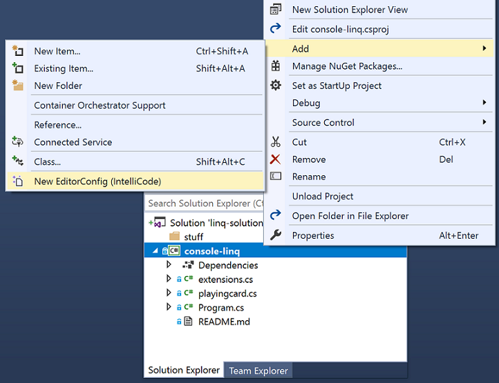

# IntelliCode for Visual Studio

The [IntelliCode extension for Visual Studio](https://marketplace.visualstudio.com/items?itemName=VisualStudioExptTeam.VSIntelliCode) provides the following functionality:

- **AI-assisted IntelliSense** for C#, C++, and XAML that predicts the most likely correct API for the developer to use instead of just an alphabetical list of members. It uses the developer's current code context and patterns to provide this dynamic list.

- AI-assisted IntelliSense **recommendations based on your own code** (C# only). For more information, see [IntelliCode models based on your code](custom-model-faq.md).

- **Inference of code style and formatting conventions** to dynamically create an [.editorconfig file](/visualstudio/ide/create-portable-custom-editor-options) from your codebase (C# only).

## Prerequisites

The [IntelliCode extension for Visual Studio](https://marketplace.visualstudio.com/items?itemName=VisualStudioExptTeam.VSIntelliCode) is supported on:

- Visual Studio 2019, or,
- Visual Studio 2017 version 15.8 and later (all SKUs)

To see AI-assisted IntelliSense for certain languages, you may need a more recent version than that required just to install the extension:

- C++ requires Visual Studio 2019 or later
- XAML requires Visual Studio 2017 version 15.9 or later

## Generate an EditorConfig file

[EditorConfig files](/visualstudio/ide/create-portable-custom-editor-options) help to keep your code consistent by defining code styles and formats. These conventions allow Visual Studio to offer automatic style and format fixes to clean up your document. For C# developers, IntelliCode can infer your code style and formatting conventions to dynamically create an EditorConfig file.

You can add an IntelliCode-generated EditorConfig file at the project or solution level in Visual Studio (or to a solution folder).

To add an EditorConfig file:

- Find the **editorconfig File (IntelliCode)** template in the **Add New Item** dialog under **Visual C# Items**, or,
- Add the file directly by right-clicking on the desired location in **Solution Explorer** and choosing **Add** > **New EditorConfig (IntelliCode)**

   

Formatting conventions don't appear in the **Error List** or as "squiggles" in your code. They can, however, be fixed using the **Code Cleanup** command (Visual Studio 2019) or the **Format Document** command (Visual Studio 2017).

If you're using Visual Studio 2017 and **Format Document** is not fixing your style conventions, you may not be opted in to style fixes. The extended capability of fixing convention-based issues in **Format Document** only covers a fixed set of issues. You can change which issues are fixed in **Tools** > **Options** under **Text Editor** > **C#** > **Code Style** > **Formatting** > **General** > **Format Document Settings (Experiment)**. The default settings don't fix some style conventions. You can opt in to these via **Tools** > **Options**. For example, **Apply implicit/explicit type preferences** runs style rules about the use of `var`.

For more information about generating an EditorConfig file based on code styles in your codebase, see [this blog article](https://aka.ms/vsicec).

### Inferred convention reference

IntelliCode doesn't yet support the full set of conventions documented in [code style settings reference](/visualstudio/ide/editorconfig-code-style-settings-reference). IntelliCode can currently infer the following [formatting](#formatting-conventions) and [style](#style-conventions) conventions:

#### Formatting conventions

- csharp_space_between_method_declaration_parameter_list_parentheses
- csharp_space_between_method_declaration_empty_parameter_list_parentheses
- csharp_space_between_method_call_name_and_opening_parenthesis
- csharp_space_between_method_call_parameter_list_parentheses
- csharp_space_between_method_call_empty_parameter_list_parentheses
- csharp_space_after_keywords_in_control_flow_statements
- csharp_space_between_parentheses
- csharp_space_after_cast
- csharp_space_after_colon_in_inheritance_clause
- csharp_space_before_colon_in_inheritance_clause
- csharp_space_around_binary_operators
- csharp_indent_switch_labels
- csharp_indent_case_contents
- csharp_indent_case_contents_when_block
- csharp_indent_labels
- csharp_preserve_single_line_blocks
- csharp_preserve_single_line_statements
- csharp_new_line_before_open_brace
- csharp_new_line_before_else
- csharp_new_line_before_catch
- csharp_new_line_before_finally
- csharp_new_line_before_members_in_object_initializers
- csharp_new_line_before_members_in_anonymous_types
- csharp_new_line_between_query_expression_clauses

#### Style conventions

- csharp_new_line_before_catch
- csharp_new_line_before_else
- csharp_new_line_before_members_in_anonymous_types
- csharp_new_line_before_members_in_object_initializers
- csharp_new_line_before_finally_style
- csharp_new_line_between_query_expression_clauses
- csharp_prefer_braces_style
- csharp_preferred_modifier_order_style
- csharp_prefer_simple_default_expression
- csharp_preserve_single_line_blocks
- csharp_space_after_cast
- csharp_space_after_keywords_in_control_flow_statements
- csharp_space_between_method_call_parameter_list_parentheses
- csharp_space_between_method_declaration_parameter_list_parentheses
- csharp_space_between_parentheses
- csharp_style_expression_bodied_accessors
- csharp_style_expression_bodied_constructors
- csharp_style_expression_bodied_indexers
- csharp_style_expression_bodied_methods
- csharp_style_expression_bodied_operators
- csharp_style_expression_bodied_properties
- csharp_style_inlined_variable_declaration
- csharp_style_pattern_local_over_anonymous_function
- csharp_style_pattern_matching_over_as_with_null_check
- csharp_style_var_for_built_in_types
- csharp_style_var_when_type_is_apparent
- dotnet_sort_system_directives_first
- dotnet_style_explicit_tuple_names
- dotnet_style_object_initializer
- dotnet_style_predefined_type_for_locals_parameters_members
- dotnet_style_predefined_type_for_member_access
- dotnet_style_prefer_inferred_anonymous_type_member_names
- dotnet_style_qualification_for_event
- dotnet_style_qualification_for_field
- dotnet_style_qualification_for_method
- dotnet_style_qualification_for_property
- dotnet_style_require_accessibility_modifiers

## Troubleshoot

If you don't see any IntelliCode suggestions, you may have extensions installed that are overriding the IntelliSense UI. This can prevent the IntelliCode "starred" suggestions from appearing at the top of the list. You can verify if extensions are causing this behavior by turning them off and then trying IntelliSense again, or, if the extension supports it, by turning off its auto-completion features.

If this doesn't solve the problem for you, please report your issue by using the Visual Studio [Report a Problem](/visualstudio/ide/how-to-report-a-problem-with-visual-studio) feature and mention IntelliCode in your report.

## See also

- [IntelliCode models based on your code](custom-model-faq.md)
- [IntelliCode FAQ](faq.md)
- [IntelliCode extension for Visual Studio Code](intellicode-visual-studio-code.md)
