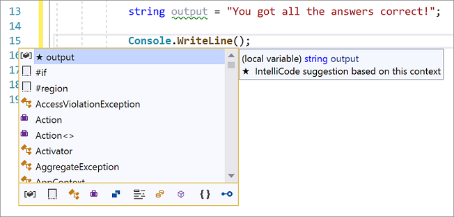
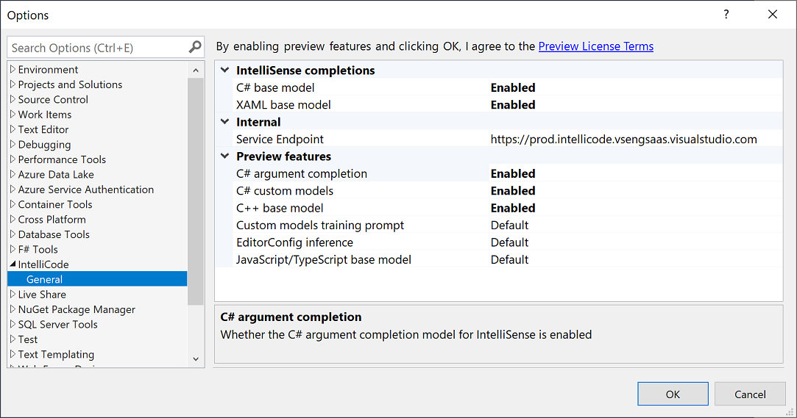

# IntelliCode for Visual Studio overview

[IntelliCode for Visual Studio](https://marketplace.visualstudio.com/items?itemName=VisualStudioExptTeam.VSIntelliCode) provides the following functionality:

- [AI-assisted IntelliSense](overview.md#context-aware-code-completions) for multiple languages that predicts the most likely correct API for the developer to use instead of just an alphabetical list of members. It uses the developer's current code context and patterns to provide this dynamic list.

   For C# users, in addition to providing member suggestions, IntelliCode also provides *argument completion*. This capability, which is currently in preview, stars the most likely argument names that you'll use when you call a method and places those suggestions at the top of the completion list. The completion list appears when you start typing inside the parentheses or press **Ctrl**+**Space**.

   

- (Preview) AI-assisted [IntelliSense recommendations based on your own code](custom-models.md) (C# only).

- (Preview) [Inference of code style and formatting conventions](code-style-inference.md) to dynamically create an [.editorconfig file](/visualstudio/ide/create-portable-custom-editor-options) from your codebase (C# only).

- (Preview) [IntelliCode refactorings](refactorings.md) which locally tracks your edits, detects when you are performing a repetitive action like a refactoring, and offers to apply that same action in other places you may need to do so (C# only).

   

## Preview features

Some of IntelliCode's features are still in preview, meaning there is no guarantee of future support. Preview features are disabled by default. To enable or disable IntelliCode preview features, choose **Tools** > **Options** > **IntelliCode**. Under **Preview Features**, choose **Enable**, **Disable**, or **Default** to configure each feature.

## Supported languages

The supported languages for AI-assisted IntelliSense completions are:

- C#
- XAML
- C++ (preview feature)
- JavaScript and TypeScript (preview feature)

## Prerequisites

Starting in Visual Studio 2019 version 16.1, IntelliCode is available as a built-in feature if you install a [supported workload](#supported-workloads). If you're using a prior version of Visual Studio, the [IntelliCode extension for Visual Studio](https://marketplace.visualstudio.com/items?itemName=VisualStudioExptTeam.VSIntelliCode) is supported on:

- Visual Studio 2019, or,
- Visual Studio 2017 version 15.8 and later (all editions)

To see AI-assisted IntelliSense for certain languages, you may need a more recent version than that required just to install the extension:

- XAML requires Visual Studio 2017 version 15.9 or later
- C++ requires Visual Studio 2019 or later
- JavaScript and TypeScript requires Visual Studio 2019 version 16.1 or later and TypeScript 3.4.2 or later

### Supported workloads

IntelliCode is included in Visual Studio 2019 version 16.1 as part of any of the following workloads:

- Azure development
- .NET desktop development
- Mobile development with .NET
- Game development with Unity
- .NET Core cross-platform development
- ASP.NET and web development
- Visual Studio extension development
- Universal Windows Platform development
- Office/SharePoint development
- Desktop development with C++
- Game development with C++
- Mobile development with C++
- Linux development with C++

## Troubleshoot

If you don't see any IntelliCode suggestions, you may have extensions installed that are overriding the IntelliSense UI. This can prevent the IntelliCode "starred" suggestions from appearing at the top of the list. You can verify if extensions are causing this behavior by turning them off and then trying IntelliSense again. Or, if the extension supports it, turn off its auto-completion features.

If this doesn't solve the problem for you, report it by using the Visual Studio [Report a Problem](/visualstudio/ide/how-to-report-a-problem-with-visual-studio) feature and mention IntelliCode in your report.

## Telemetry

IntelliCode captures some anonymized usage and error-reporting data to help improve the product. No user-defined code is sent to Microsoft, but we do collect information about your use of the IntelliCode results.

For base model suggestions, which are open source or .NET types and members, we capture whether you selected an IntelliCode suggestion and log the name of the suggestion. Microsoft uses the data to monitor the quality of the base model. For custom models, we capture whether you selected an IntelliCode suggestion but *do not* log the names of your user-defined types or methods.

To turn off data collection for IntelliCode, opt out of the [Visual Studio Experience Improvement Program](/visualstudio/ide/visual-studio-experience-improvement-program). From the menu bar, select **Help** > **Send Feedback** > **Settings**. In the **Visual Studio Experience Improvement Program** dialog, select **No, I would not like to participate** and then select **OK**.

To create models that learn patterns from your own C# code, you need to [sign in to Visual Studio](/visualstudio/ide/signing-in-to-visual-studio) to be able to use the model training service. The training service collects only the minimum data that's required to create the model. Microsoft keeps the trained models secured to your account so only you and those you choose to share them with can access them. Your model and what it’s learned about your code stays private to you. For more information, see [Data and privacy](custom-models.md#data-and-privacy).

## Provide feedback

To report an IntelliCode for Visual Studio bug, use the [Help > Send Feedback > Report a Problem](/visualstudio/ide/how-to-report-a-problem-with-visual-studio) menu. If you reproduce the problem before submitting the report, logs are automatically included in the report.

For feature requests, click the  **Send feedback about** > **This product** button at the bottom of this page to log a new issue. Mention that it's a feature request.

## See also

- [IntelliCode overview](overview.md)
- [Custom models based on your code](custom-models.md)
- [IntelliCode extension for Visual Studio Code](intellicode-visual-studio-code.md)
