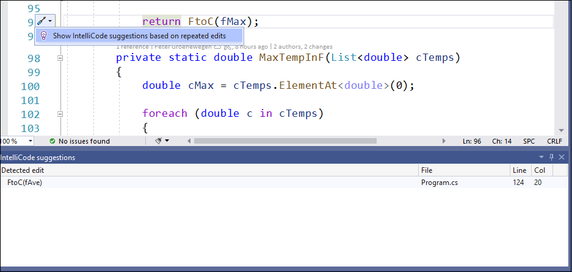

# Suggestions - Suggestion Level 
IntelliCode improves your editing experience when you're making similar edits in multiple places in your code. It locally tracks your edits, detects when you're performing a repetitive action, and offers to apply that same action in other places where you may want it. For example, if you're making a refactoring and have missed locations where it could be applied, IntelliCode helps you find those locations and fix them.

When IntelliCode detects a repeated edit and finds opportunities to apply it in your currently open documents, you'll see a lightbulb like the one shown below, and an action allowing you to see a list of the suggestions found. You can use the link to open the IntelliCode suggestions window which lets you locate and act on those suggestions.

Suggestions show up in the Visual Studio editor as a [Quick Action light bulb](/visualstudio/ide/quick-actions) , along with grey-dotted [suggestion-level squiggles](/visualstudio/get-started/csharp/visual-studio-ide#popular-productivity-features) and entries in the new IntelliCode suggestions toolwindow, as shown in the screenshot below:

When you see a light bulb on a line of code with a suggestion, select it to display a menu from which you can apply the suggested change.

> [!NOTE]
> IntelliCode suggestions no longer show in the Visual Studio Error List; instead they are shown solely in the IntelliCode suggestions toolwindow.

## Changes IntelliCode can detect
IntelliCode is aware of the semantic structure of your code. It detects situations where the variable names in your changes are different but the essential structure of the change is the same:

If you don’t like a suggested change, select the **Ignore** option on the light bulb, and IntelliCode won’t bother you about that pattern again unless you recreate it. 

## Enable suggestions
Suggestions is turned on by default. 
If you wish to turn it off, choose **Tools** > **Options**, **IntelliCode General** tab, and then switch **C# suggestions** to **Disabled**:

After you change this setting, close any open files, and then restart Visual Studio.
